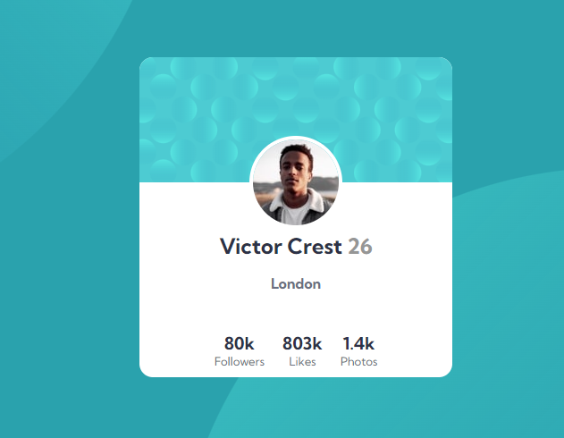

# Frontend Mentor - Profile card component solution

This is a solution to the [Profile card component challenge on Frontend Mentor](https://www.frontendmentor.io/challenges/profile-card-component-cfArpWshJ). Frontend Mentor challenges help you improve your coding skills by building realistic projects. 

## Table of contents

- [Overview](#overview)
  - [The challenge](#the-challenge)
  - [Screenshot](#screenshot)
  - [Links](#links)
- [My process](#my-process)
  - [Built with](#built-with)
  - [What I learned](#what-i-learned)
- [Author](#author)
- [Acknowledgments](#acknowledgments)

## Overview

### The challenge

- Build out the project to the designs provided

### Screenshot

<br><br>

### Links

- Solution URL: [https://github.com/Vitor5782/Projeto-4-FrontEndMentor](https://github.com/Vitor5782/Projeto-4-FrontEndMentor)
- Live Site URL: [https://vitor5782.github.io/Projeto-4-FrontEndMentor/](https://vitor5782.github.io/Projeto-4-FrontEndMentor/)

## My process

### Built with

- Semantic HTML5 markup
- CSS custom properties
- Flexbox
- Mobile-first workflow

### What I learned

Fiz uso de html semantico para a construção desta pagina, estou satisfeito em como meu site é visivel nas diferentes telas dos usarios.

```css
body {
    background-image: url(../images/bg-pattern-top.svg), url(../images/bg-pattern-bottom.svg);
    background-repeat: no-repeat;
    background-position: right 60vw bottom 45vh, left 40vw top 40vh;
}
```
## Author

- Website - [Vitor Hugo Teixeira](https://github.com/vitor5782)
- Frontend Mentor - [@Vitor5782](https://www.frontendmentor.io/profile/Vitor5782)
- Facebook - [@vitorhugoteixeira](https://www.facebook.com/vitor.hugo.3591267/)

## Acknowledgments

Agradecimento especial ao curso DEV EM DOBRO que tem me ensinado muito, é graças a eles que estou sendo capaz de chegar onde estou, e quero continuar em frente seguindo um otimo caminho no mundo da tecnologia. 
